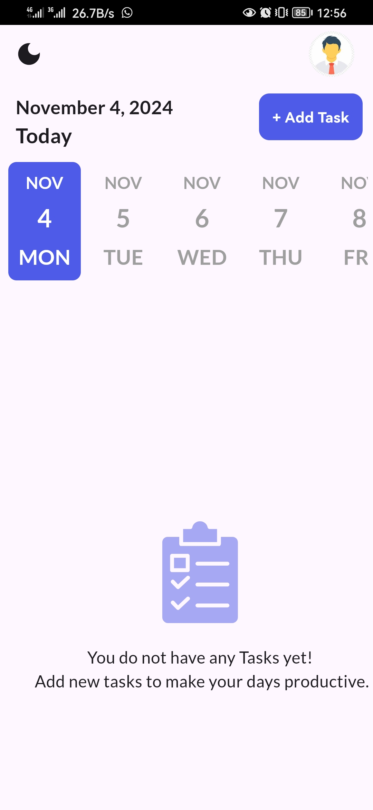

# ✅ To-Do App

A beautiful and functional Flutter To-Do app that helps you manage your daily tasks effortlessly.

## ✨ Features

- 🗓️ Filter tasks by date
- ➕ Add task screen with:
  - Title, note, start & end time
  - Start & end date
  - Repeat mechanism (daily, weekly, etc.)
  - Reminders
- 🔔 Local notifications
- 🎨 Color-coded task tiles
- 🧠 Smart, responsive UI with a smooth user experience

## 📸 Screenshots

  
  

## 📚 Credits

Built while following the excellent course:  
[Flutter & Dart - The Complete Guide](https://www.udemy.com/course/fluttercourse/)

